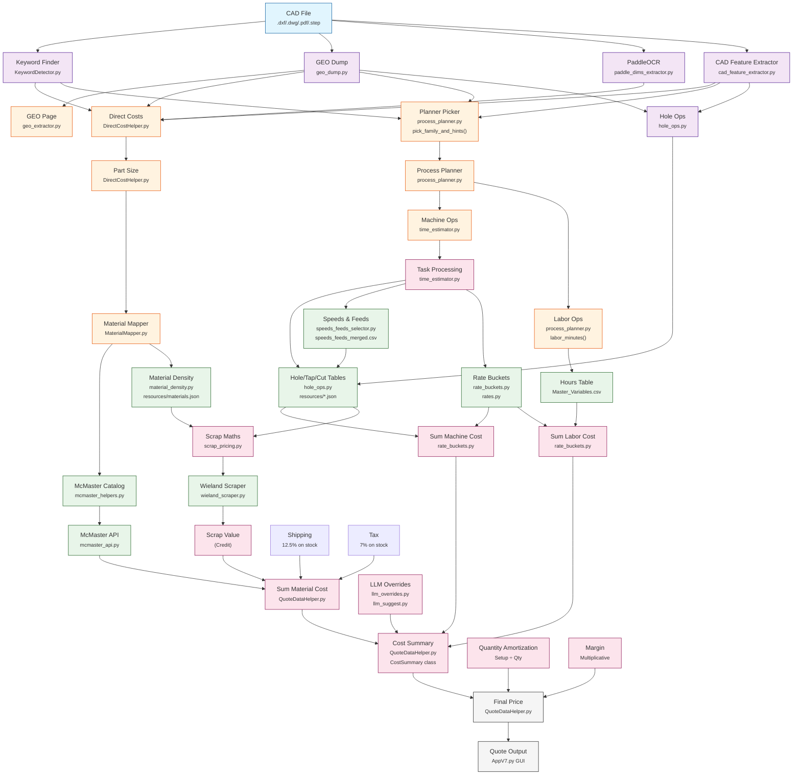

# AppV7 Process Flow

## Component Details

### Input Processing
| Component | File | Description |
|-----------|------|-------------|
| CAD File | - | Input files (.dxf, .dwg, .pdf, .step) |
| Keyword Finder | `cad_quoter/pricing/KeywordDetector.py` | Detects process keywords from CAD |
| GEO Dump | `cad_quoter/geo_dump.py` | Extracts geometric data |
| PaddleOCR | `tools/paddle_dims_extractor.py` | OCR for dimension extraction |
| CAD Feature Extractor | `cad_quoter/cad_feature_extractor.py` | Comprehensive feature analysis |

### Planning & Operations
| Component | File | Description |
|-----------|------|-------------|
| Direct Costs | `cad_quoter/pricing/DirectCostHelper.py` | Direct cost calculations |
| GEO Page | `cad_quoter/geo_extractor.py` | GEO page extraction |
| Planner Picker | `cad_quoter/planning/process_planner.py` | `pick_family_and_hints()` function |
| Process Planner | `cad_quoter/planning/process_planner.py` | Main planning logic |
| Machine Ops | `cad_quoter/pricing/time_estimator.py` | Machine time estimation |
| Labor Ops | `cad_quoter/planning/process_planner.py` | `labor_minutes()` functions |
| Hole Ops | `tools/hole_ops.py` | Hole/tap/cut operations |

### Material & Pricing
| Component | File | Description |
|-----------|------|-------------|
| Material Mapper | `cad_quoter/pricing/MaterialMapper.py` | Maps materials to sources |
| McMaster Catalog | `cad_quoter/pricing/mcmaster_helpers.py` | McMaster catalog lookup |
| McMaster API | `cad_quoter/mcmaster_api.py` | API interface |
| Material Density | `cad_quoter/material_density.py` | Density calculations |
| Scrap Pricing | `cad_quoter/pricing/scrap_pricing.py` | Scrap value calculations |
| Wieland Scraper | `cad_quoter/pricing/wieland_scraper.py` | Scrap price scraping |

### Cost Calculation
| Component | File | Description |
|-----------|------|-------------|
| Rate Buckets | `cad_quoter/pricing/rate_buckets.py` | Machine/labor rates |
| Rates | `cad_quoter/pricing/rates.py` | Rate definitions |
| Speeds & Feeds | `cad_quoter/pricing/speeds_feeds_selector.py` | Machining parameters |
| Cost Summary | `cad_quoter/pricing/QuoteDataHelper.py` | `CostSummary` class |

### Overrides & Output
| Component | File | Description |
|-----------|------|-------------|
| LLM Overrides | `cad_quoter/llm_overrides.py` | AI-driven adjustments |
| LLM Suggest | `cad_quoter/llm_suggest.py` | AI suggestions |
| Final Price | `cad_quoter/pricing/QuoteDataHelper.py` | Final quote calculation |
| GUI Output | `AppV7.py` | Tkinter GUI display |

## Key Data Files
- `cad_quoter/resources/Master_Variables.csv` - Rates and variables
- `cad_quoter/pricing/resources/speeds_feeds_merged.csv` - Machining data
- `cad_quoter/resources/materials.json` - Material definitions
- Various `.json` configs for drilling, amortization, etc.

## Business Logic Notes
- **Tax**: 7% applied to McMaster stock
- **Shipping**: 12.5% applied to McMaster stock
- **Scrap**: Calculated as credit (subtracted from cost)
- **Margin**: Applied multiplicatively to total
- **Quantity**: Setup costs amortized by quantity
